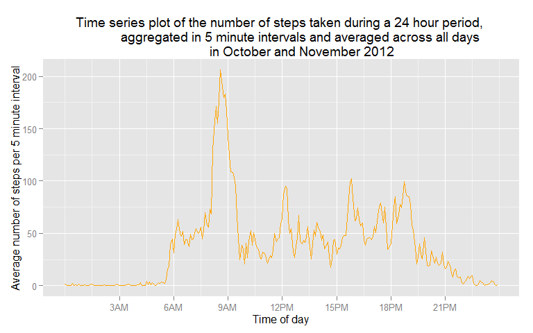
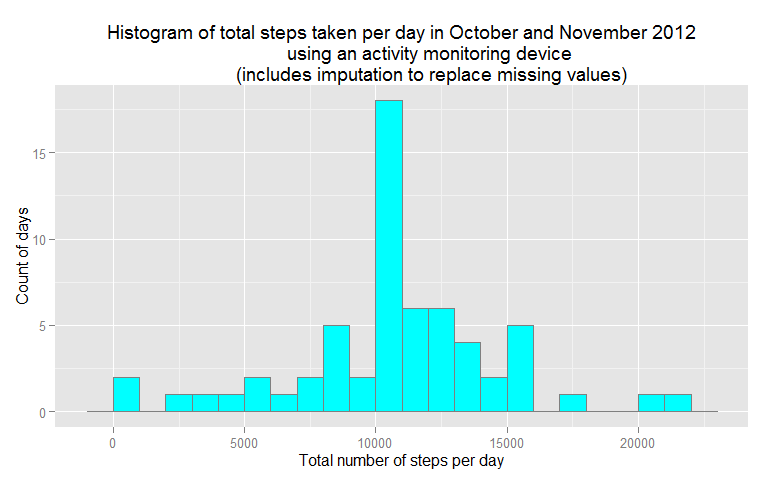
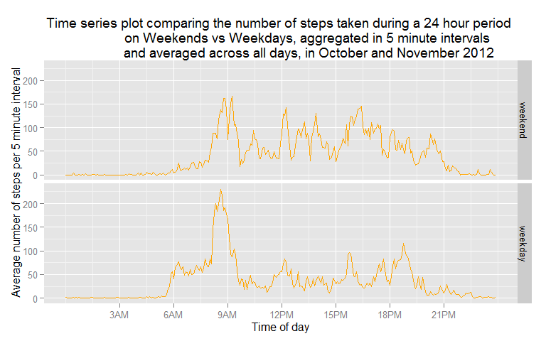

# Reproducible Research: Peer Assessment 1

This assignment makes use of data from a personal activity monitoring device. This device collects data at 5 minute intervals through out the day. The data consists of two months of data from an anonymous individual collected during the months of October and November, 2012 and include the number of steps taken in 5 minute intervals each day.

#### The 5 tasks performed in this report to load the data and answer the assignment questions are:
1. Loading and preprocessing the data
2. What is mean total number of steps taken per day?
3. What is the average daily activity pattern?
4. Imputing missing values
5. Are there differences in activity patterns between weekdays and weekends?


## 1. Loading and preprocessing the data

The data for this assignment can be downloaded from the course web site:  
Dataset: [Activity monitoring data]("https://d396qusza40orc.cloudfront.net/repdata%2Fdata%2Factivity.zip") [52kb]  

#### The variables included in this dataset are:

* steps: Number of steps taking in a 5-minute interval (missing values are coded as NA)
* date: The date on which the measurement was taken in YYYY-MM-DD format
* interval: Identifier for the 5-minute interval in which measurement was taken

The dataset is stored in a comma-separated-value (CSV) file and there are a total of 17568 observations in this dataset.

Download the data into the working directory:

```r
download.file("http://d396qusza40orc.cloudfront.net/repdata%2Fdata%2Factivity.zip",
              "activity.zip")
```
Load the plyr and dplyr package, unzip and load the data as a _data frame tbl_ object named **activity** for easier manipulation with functions from the plyr and dplyr package later in this assignment.

```r
require(plyr, quietly = TRUE, warn.conflicts = FALSE)
require(dplyr, quietly = TRUE, warn.conflicts = FALSE)
activity <- tbl_df(read.csv(unz("activity.zip", "activity.csv")))
```
Load the lubridate package and convert the **_date_** variable from _factor_ to _POSIXct date_ class.

```r
require(lubridate)
```

```
## Loading required package: lubridate
## 
## Attaching package: 'lubridate'
## 
## The following object is masked from 'package:plyr':
## 
##     here
```

```r
activity$date <- ymd(activity$date)
```
Review two summaries of **activity**

```r
summary(activity)
```

```
##      steps             date               interval     
##  Min.   :  0.00   Min.   :2012-10-01   Min.   :   0.0  
##  1st Qu.:  0.00   1st Qu.:2012-10-16   1st Qu.: 588.8  
##  Median :  0.00   Median :2012-10-31   Median :1177.5  
##  Mean   : 37.38   Mean   :2012-10-31   Mean   :1177.5  
##  3rd Qu.: 12.00   3rd Qu.:2012-11-15   3rd Qu.:1766.2  
##  Max.   :806.00   Max.   :2012-11-30   Max.   :2355.0  
##  NA's   :2304
```

```r
str(activity)
```

```
## Classes 'tbl_df', 'tbl' and 'data.frame':	17568 obs. of  3 variables:
##  $ steps   : int  NA NA NA NA NA NA NA NA NA NA ...
##  $ date    : POSIXct, format: "2012-10-01" "2012-10-01" ...
##  $ interval: int  0 5 10 15 20 25 30 35 40 45 ...
```


## 2. What is the mean total number of steps taken per day?

Omit records from **actvity** with missing values, then use group_by() and summarise() from the the dplyr package to calculate the total number of steps taken per day. 
From this new object **daily_steps** we calculate the mean and median steps per day for the whole period.

```r
total_days <- length(unique(activity$date))
daily_steps <- activity %>% na.omit() %>% group_by(date) %>% summarise(sum(steps))
colnames(daily_steps)[2] <- "total_steps"
valid_days <- length(unique(daily_steps$date))
mean_daily_steps <- as.integer(mean(daily_steps$total_steps))
median_daily_steps <- median(daily_steps$total_steps)
```
There are 61 unique dates in **activity** but only 53 unique dates with stepcounts after omiting all records with missing values.


```r
require(ggplot2, quietly = TRUE, warn.conflicts = FALSE)
```

```
## Warning: package 'ggplot2' was built under R version 3.1.3
```

```r
# Create the histogram of the total number of steps taken each day
ggplot(daily_steps, aes(x=total_steps)) +
    geom_histogram(binwidth=1000, fill="cyan", colour="grey50", size=.2) +
    xlab("Total number of steps per day") +
    ylab("Count of days") +
    ggtitle("Histogram of total steps taken per day in October and November 2012
            using an activity monitoring device")
```

 

The mean total number of steps taken per day is **10766**.  
The median total number of steps taken per day is **10765**.

## 3. What is the average daily activity pattern?

We illustrate the average daily activity pattern using a time series plot of the 5-minute interval (x-axis) and the average number of steps taken, averaged across all days (y-axis).
We again omit records with missing values from **activity** before using group_by() and summarise() to calculate the average number of steps  per 5 minute interval.  

```r
# calculate the average number of steps  per 5 minute interval  
interval_steps <- activity %>% na.omit() %>% group_by(interval) %>% summarise(mean(steps))
# load the chron package to create a new version of the interval variable of class "times"
require(chron, quietly = TRUE, warn.conflicts = FALSE)
```

```
## Warning: package 'chron' was built under R version 3.1.3
```

```r
day <- format( seq.POSIXt(as.POSIXct(Sys.Date()), as.POSIXct(Sys.Date()+1), by = "5 min"), "%H%M%S", tz="GMT")
for (i in 0:9) { day <- sub(paste("^0",i, sep = ""), paste("0",i,":", sep = ""), day) }
for (i in 10:23) { day <- sub(paste("^",i, sep = ""), paste(i,":", sep = ""), day) }
day <- sub("00$", ":00", day)
day <- day[1:288]
interval2 <- as.data.frame(chron(times = day))
interval_steps <- cbind(interval_steps, interval2)
colnames(interval_steps) <- c("interval", "mean_steps", "interval2")
# calculate which 5 minute interval has the maximum average steps for the two month time period
max_steps <- interval_steps[which.max(interval_steps[,2]),1]
# Create the time series plot of average step frequency during a 24 hr period 
ggplot(interval_steps, aes(x = interval2, y = mean_steps)) + geom_line(colour=
        "orange", size=.5) + 
        scale_x_continuous(breaks=c(0.125, 0.25, 0.375, 0.5, 0.625, 0.75, 0.875), 
        labels=c("3AM", "6AM", "9AM", "12PM", "15PM", "18PM", "21PM")) + 
        xlab("Time of day") + ylab("Average number of steps per 5 minute interval") +
    ggtitle("Time series plot of the number of steps taken during a 24 hour period, 
            aggregated in 5 minute intervals and averaged across all days 
            in October and November 2012")
```

 

The **835** 5-minute interval (from 08:35 am to 08:39 am) contains the maximum number of steps, on average across all the days in the dataset.


## 4. Imputing missing values


```r
rows <- dim(activity)[1]
complete_records <- sum(complete.cases(activity))
na_records <- dim(activity)[1] - complete_records
na_steps <- sum(is.na(activity$steps))
na_date <- sum(is.na(activity$date))
na_interval <- sum(is.na(activity$interval))
```
The raw data provided has **17568** rows of data. There are 0 NA values in the **_date_** variable and 0 NA values in the **_interval_** variable. The 2304 NA values in the **_steps_** variable account for why there are **2304** rows with missing values and **15264** rows with no missing values, in the provided data. 

The mean and median values for total steps are close in value while the shape of the time series data suggests a pattern related to the time of day. Therefor let us use the mean for each 5-minute interval to impute values for the missing data creating a new  data frame called **imputed_actvity**

```r
# merge average 5-minute interval caluclated before to activity data
imputed_activity <- merge(activity, interval_steps, by = "interval", all = F)
imputed_activity$interval2 <- NULL
# if steps is NA, replace with mean_steps, otherwise replace with the original value. 
imputed_activity = transform(imputed_activity, steps = ifelse(is.na(steps), imputed_activity$mean_steps, steps))
# calculate the total steps per day and mean + median steps per day for the dataset with imputed values
imputed_daily_steps <- imputed_activity %>% group_by(date) %>% summarise(sum(steps))
colnames(imputed_daily_steps)[2] <- "total_steps"
imputed_mean_daily_steps <- as.integer(mean(imputed_daily_steps$total_steps))
imputed_median_daily_steps <- as.integer(median(imputed_daily_steps$total_steps))
require(ggplot2, quietly = TRUE, warn.conflicts = FALSE)
# Create the histogram of the total number of steps taken each day
ggplot(imputed_daily_steps, aes(x=total_steps)) +
    geom_histogram(binwidth=1000, fill="cyan", colour="grey50", size=.2) +
    xlab("Total number of steps per day") +
    ylab("Count of days") +
    ggtitle("Histogram of total steps taken per day in October and November 2012
            using an activity monitoring device 
            (includes imputation to replace missing values)")
```

 

The mean total number of steps taken per day for **imputed_activity** data frame is **10766**.  
The median total number of steps taken per day for **imputed_activity** data frame is **10766**.  
The median total number of steps taken increases by 1 using this imputation stategy. The mean does not change.  However the mass of data at the mean is increased by the imputation strategy as illustrated by the histogram.  

## 5. Are there differences in activity patterns between weekdays and weekends?


```r
# Create a new factor variable in the dataset with two levels - "weekday" and "weekend" indicating whether a given date is a weekday or weekend day.
imputed_activity <- imputed_activity %>% mutate(weekday = wday(date, label = TRUE))
imputed_activity$weekday <- revalue(imputed_activity$weekday, c("Sun"="weekend", "Sat"="weekend", 
                                    "Mon"="weekday", "Tues"="weekday", "Wed"="weekday", 
                                      "Thurs"="weekday", "Fri" = "weekday"))
# calculate the average number of steps  per 5 minute interval  
imputed_interval_steps <- imputed_activity %>% group_by(weekday, interval) %>% summarise(mean(steps))
# add time of day variable representing the 5 minute intervals in a more readable format
interval3 <- rbind(interval2, interval2)
imputed_interval_steps <- cbind(imputed_interval_steps, interval3)
imputed_interval_steps[,3] <- round(imputed_interval_steps[,3], 3)
colnames(imputed_interval_steps) <- c("weekday", "interval", "mean_steps", "time_of_day")
# calculate which 5 minute interval has the maximum average steps for the two month time period
imputed_max_steps <- imputed_interval_steps[which.max(imputed_interval_steps[,3]),2]
# Create the time series plot of average step frequency during a 24 hr period 
ggplot(imputed_interval_steps, aes(x = time_of_day, y = mean_steps)) + geom_line(colour=
        "orange", size=.5) + facet_grid(weekday ~ .) +
        scale_x_continuous(breaks=c(0.125, 0.25, 0.375, 0.5, 0.625, 0.75, 0.875), 
        labels=c("3AM", "6AM", "9AM", "12PM", "15PM", "18PM", "21PM")) + 
        xlab("Time of day") + ylab("Average number of steps per 5 minute interval") +
        ggtitle("Time series plot comparing the number of steps taken during a 24 hour period 
                on Weekends vs Weekdays, aggregated in 5 minute intervals 
                and averaged across all days, in October and November 2012")
```

 

Step activity in the **imputed_activity** data frame appears to start earlier in the day on weekdays
and step activity is higher during the midday period on weekends.
